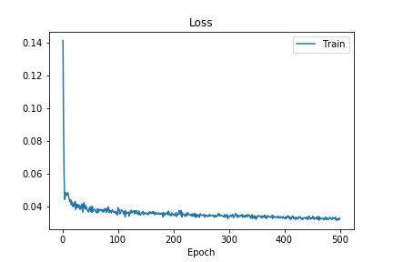
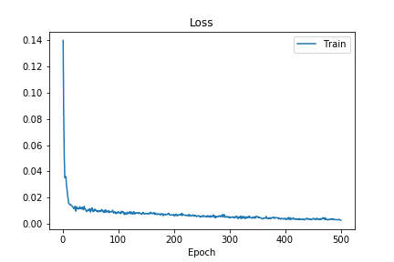
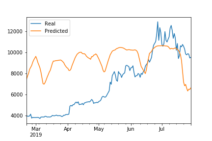
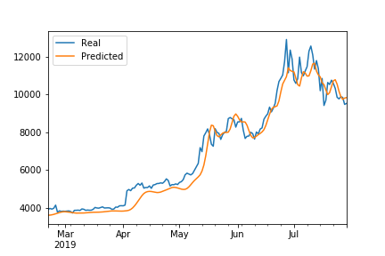

# deep_learning_homework_uw_fintech

<br><br>
## Summary
___
Leveraging the Crypto Fear and Greed Index (FNG) and Bitcoin closing prices from 1/02/2018 through 7/29/2019 as the basis analysis, Long short-term memory (LSTM) Recurrent Neural Network (RNN) predictive models were used to predict the volatile "next closing price" of Bitcoin.
<br><br>
Two LSTM RNNs were modeled, one leveraging the FNG sentiment score as the training set, and the other simply used the closing price. Both models, leveraged the same prepped dataset that used the window_data function (below)

 ```python:
def window_data(df, window, feature_col_number, target_col_number):
    X = []
    y = []
    for i in range(len(df) - window - 1):
        features = df.iloc[i:(i + window), feature_col_number]
        target = df.iloc[(i + window), target_col_number]
        X.append(features)
        y.append(target)
    return np.array(X), np.array(y).reshape(-1, 1)
 ```
In both cases, the parameter for window_size was set to a 10 day window as that slicing led to better results among both models, more so on the closing-price model than the FNG, which could have gone down to 6 or 7 days. 
<br><br>
LSTM parameters were set to run on 5 layers with 10 nodes per layer, with one output node for the prediction. Batch size and epoch parameters were also kept consistent with 30 and 500 respectively. Batch size seemed to be more of a reactive lever than that of the number of layers. Parameters were experimented from 1 to 50 in batch sizes, with less batch sizes seeming to underfit the model, whereas more batch sizes caused overfitting. Between 20 and 35 seemed to be a sweet spot for 5 layers. 


FNG got close to the movement of the closing price, but was very off to due to bias. Closing price was a much tighter fit on the model which had both a better lower loss history and tracked better to the actual values of Bitcoin over time.
<br><br>

## Which model has a lower loss?
___
### FNG LSTM Model

<br><br>
## Closing Price LSTM Model

<br><br>

## Which model tracks the actual values better over time?
___
### FNG LSTM Model

<br><br>
I was able to get a better model, not by much, using 6 and 7 as the window size and a batch size in the 20s, but for the purposes of this homework, kept the parameters the same, as advised, as the parameter success on the Closing Price model outweight the tuning of the FNG.

### Closing Price LSTM Model

<br><br>

## Which window size works best for the model?
___
10 seems to match the closing price actuals much tigher than the intervals from 4-7, which is where the sweet spot was for FNG, but the precision of the FNG was not even close to the success of the closing price.